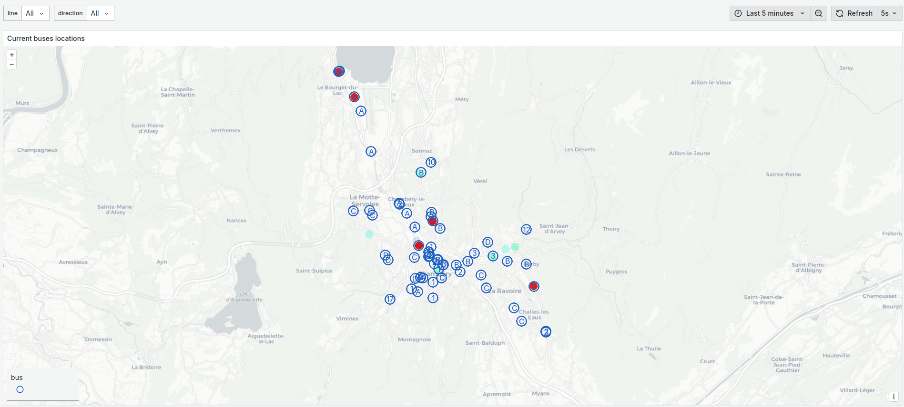

# Screenshots

# Run

1. Install Deno: https://docs.deno.com/runtime/getting_started/installation/
2. Copy `.env.example` to `.env`
3. Fill up your PostgreSQL credentials
4. Start the program: `deno task dev`

# Configure Grafana

Import the dashboards files located in the `dashboards` folder.